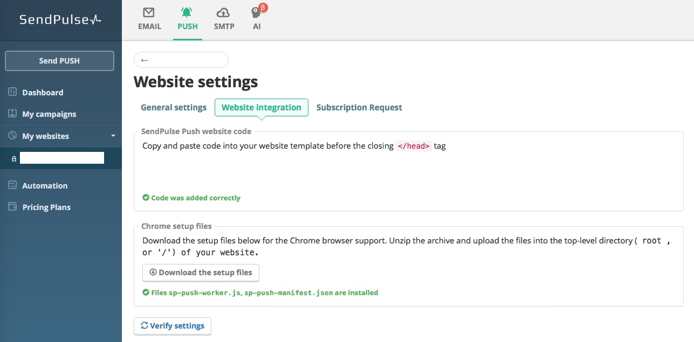
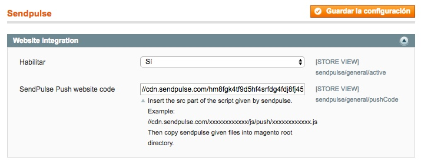

# Sendpulse WebPush Magento module

This module integrates [Sendpulse](https://sendpulse.com/) web notifications on [Magento](https://magento.com/).

## Features

  * Web Push Notifications
  * Configuration

## Usage
  * After installing the module, sign up in [sendpulse](https://sendpulse.com/) and go to "Push". Add your domain and you get a script like this:
  ```
  <script charset="UTF-8" src="//cdn.sendpulse.com/123abc456def789ghi123jkl/js/push/321abc654def987ghi321jkl.js" async></script>
  ```
  
  
  
  * Copy only the src content
  ```
  //cdn.sendpulse.com/123abc456def789ghi123jkl/js/push/321abc654def987ghi321jkl.js
  ```
  * And paste it in the module config
  
  
  
  * Download the setup files and upload them into your root directory in your magento.
  
  